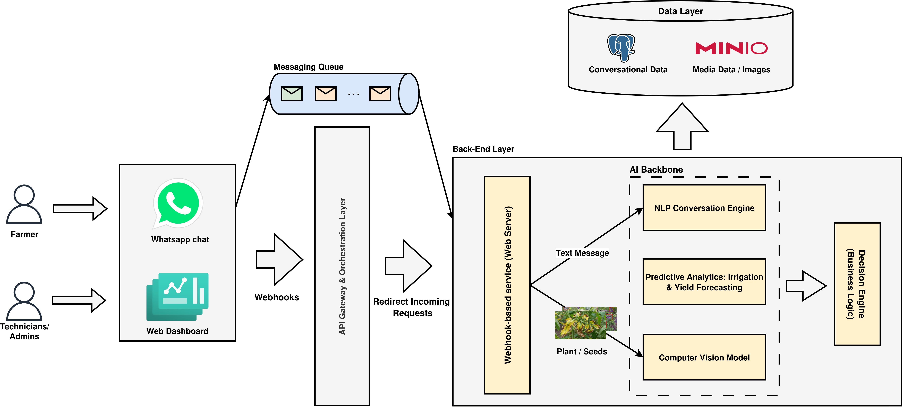

<div align="center">

# AgriBot
**WhatsApp webhook backend for agricultural support, built with FastAPI and Meta WhatsApp Cloud API**

<p>
  
  
  
  
  
  
</p>

</div>

## Overview
AgriBot is a FastAPI service that receives WhatsApp webhook events from Meta, stores incoming messages, downloads user media, uploads it to object storage (S3-compatible), and replies to users automatically.

It is designed as a practical backend foundation for agriculture-focused conversational assistants.

## Architecture
The high-level architecture is shown below:



## Core Features
- Meta webhook verification (`GET /webhook`)
- Incoming message processing (`POST /webhook`)
- Message persistence using async database access
- Media retrieval from Meta Graph API
- Media upload to S3-compatible storage
- Background processing for image workflows
- Automatic WhatsApp reply to incoming users

## Tech Stack
- **Backend API:** FastAPI
- **Language:** Python
- **HTTP Client:** httpx
- **Database Layer:** SQLAlchemy (async)
- **Migrations:** Alembic
- **Storage:** boto3 (S3-compatible bucket)
- **Tunnel for local webhook testing:** ngrok
- **Messaging Provider:** Meta WhatsApp Cloud API

## Project Structure
```text
AgriBot/
├── README.md
├── whtspp_chat.py
├── requirements.txt
├── AgriBot-HightOverview.png
├── app_arch.drawio
└── repositories/
```

## Quick Start
### 1) Clone and enter the project
```bash
git clone <your-repo-url>
cd AgriBot/AgriBot
```

### 2) Create and activate a virtual environment
```bash
python -m venv .venv
source .venv/bin/activate
```

### 3) Install dependencies
```bash
pip install -r requirements.txt
```

### 4) Configure environment variables
Create a `.env` file in the project root and set:

```env
VERIFY_TOKEN=your_verify_token
ACCESS_TOKEN=your_meta_access_token
PHONE_NUMBER_ID=your_whatsapp_phone_number_id
GRAPH_API_VERSION=v17.0

ACCOUNT_ID=your_storage_account_id
ACCESS_KEY_ID=your_storage_access_key
SECRET_ACCESS_KEY=your_storage_secret_key
BUCKET_NAME=your_bucket_name
ENDPOINT_URL=your_s3_endpoint_url
```

### 5) Run the API
```bash
uvicorn whtspp_chat:app --host 0.0.0.0 --port 8000 --reload
```

## Local Webhook Testing with ngrok
Expose your local server:

```bash
ngrok http 8000
```

Use the generated HTTPS URL in the Meta Developer webhook settings:
- **Callback URL:** `https://<ngrok-id>.ngrok-free.app/webhook`
- **Verify token:** must match `VERIFY_TOKEN` in your `.env`

## API Endpoints
- `GET /webhook` - Verify webhook ownership with Meta.
- `POST /webhook` - Receive WhatsApp events and process messages/media.

## Security Notes
- Never commit `.env`, access tokens, private keys, certificates, or recovery files.
- Rotate credentials if any secret has been exposed.
- Restrict bucket permissions and apply least-privilege access.

## Roadmap Ideas
- Add NLP/LLM-powered agronomy responses
- Add multilingual support (dialect-aware)
- Add conversation state and user profiles
- Add observability (structured logs, tracing, metrics)
- Add CI checks and deployment pipeline

## License
Add your preferred license (MIT, Apache-2.0, etc.) in a `LICENSE` file.
>>>>>>> 3cf9236 (Updated README)
=======
=======
<div align="center">

# AgriBot

**WhatsApp webhook backend for agricultural support, built with FastAPI and Meta WhatsApp Cloud API**

<p>
  
  
  
  
  
  
</p>

</div>

## Overview
AgriBot is a FastAPI service that receives WhatsApp webhook events from Meta, stores incoming messages, downloads user media, uploads it to object storage (S3-compatible), and replies to users automatically.

It is designed as a practical backend foundation for agriculture-focused conversational assistants.

## Architecture
The high-level architecture is shown below:


## Core Features
- Meta webhook verification (`GET /webhook`)
- Incoming message processing (`POST /webhook`)
- Message persistence using async database access
- Media retrieval from Meta Graph API
- Media upload to S3-compatible storage
- Background processing for image workflows
- Automatic WhatsApp reply to incoming users

## Tech Stack
- **Backend API:** FastAPI
- **Language:** Python
- **HTTP Client:** httpx
- **Database Layer:** SQLAlchemy (async)
- **Migrations:** Alembic
- **Storage:** boto3 (S3-compatible bucket)
- **Tunnel for local webhook testing:** ngrok
- **Messaging Provider:** Meta WhatsApp Cloud API

## Project Structure
```text
AgriBot/
├── README.md
├── whtspp_chat.py
├── requirements.txt
├── AgriBot-HightOverview.png
├── app_arch.drawio
└── repositories/
```

## Quick Start
### 1) Clone and enter the project
```bash
git clone <your-repo-url>
cd AgriBot/AgriBot
```

### 2) Create and activate a virtual environment
```bash
python -m venv .venv
source .venv/bin/activate
```

### 3) Install dependencies
```bash
pip install -r requirements.txt
```

### 4) Configure environment variables
Create a `.env` file in the project root and set:

```env
VERIFY_TOKEN=your_verify_token
ACCESS_TOKEN=your_meta_access_token
PHONE_NUMBER_ID=your_whatsapp_phone_number_id
GRAPH_API_VERSION=v17.0

ACCOUNT_ID=your_storage_account_id
ACCESS_KEY_ID=your_storage_access_key
SECRET_ACCESS_KEY=your_storage_secret_key
BUCKET_NAME=your_bucket_name
ENDPOINT_URL=your_s3_endpoint_url
```

### 5) Run the API
```bash
uvicorn whtspp_chat:app --host 0.0.0.0 --port 8000 --reload
```

## Local Webhook Testing with ngrok
Expose your local server:

```bash
ngrok http 8000
```

Use the generated HTTPS URL in the Meta Developer webhook settings:
- **Callback URL:** `https://<ngrok-id>.ngrok-free.app/webhook`
- **Verify token:** must match `VERIFY_TOKEN` in your `.env`

## API Endpoints
- `GET /webhook` - Verify webhook ownership with Meta.
- `POST /webhook` - Receive WhatsApp events and process messages/media.

## Security Notes
- Never commit `.env`, access tokens, private keys, certificates, or recovery files.
- Rotate credentials if any secret has been exposed.
- Restrict bucket permissions and apply least-privilege access.

## Roadmap Ideas
- Add NLP/LLM-powered agronomy responses
- Add multilingual support (dialect-aware)
- Add conversation state and user profiles
- Add observability (structured logs, tracing, metrics)
- Add CI checks and deployment pipeline

## License
Add your preferred license (MIT, Apache-2.0, etc.) in a `LICENSE` file.
>>>>>>> 3cf9236 (Updated README)
>>>>>>> f17bb8a (Update gitignore and add image)
